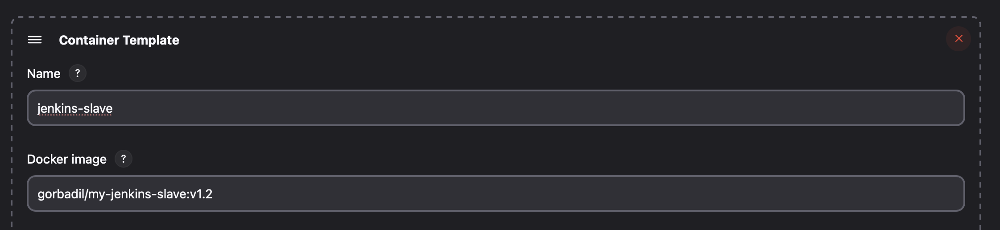
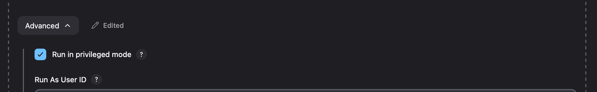
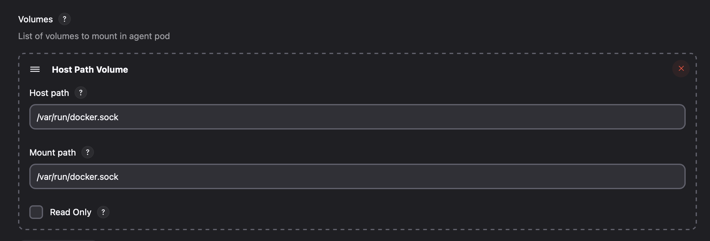

<!-- ingilizceye çevir -->

# Automation with Github, Jenkins and DockerHub

In this article, we will automate between Github, Jenkins and DockerHub, so that Jenkins automatically builds after each commit in Github and pushes it to DockerHub. This way, we can automatically update the image we created in DockerHub after each commit in Github.

Jenkins runs in master-slave mode on Kubernetes. Jenkins master will create Docker images through Jenkins slaves. Docker must be installed on Jenkins slaves. To install Docker on Jenkins slaves, you can run the following commands.

You can check [Jenkins on Kubernetes](https://medium.com/@gorbadil/jenkins-on-kubernetes-8d2c422c08b8) article for more information.

## VPS

We need to edit the Dockerfile for Jenkins slaves.

Jenkins Master Dockerfile

```Dockerfile
FROM jenkins/jenkins:lts-slim-jdk17
USER root
RUN apt update && curl -fsSL https://get.docker.com | sh
RUN usermod -aG systemd-journal jenkins
RUN jenkins-plugin-cli --plugins kubernetes
USER jenkins
```

Jenkins Master Dockerfile

```Dockerfile
FROM jenkins/agent
USER root
RUN apt update && curl -fsSL https://get.docker.com | sh
RUN usermod -aG systemd-journal jenkins
USER jenkins
```

- The reason we add the jenkins user to the systemd-journal group is that it is necessary for Jenkins to run Docker commands. If the group permission in the command output below is a different group, you may get an error when running Docker commands.

```bash
$ ls -l /var/run/docker.sock
srw-rw---- 1 root systemd-journal 0 Mar  1 14:00 /var/run/docker.sock
```

```bash
docker build -t <dockerhub username>/jenkins-master -f Dockerfile .
docker build -t <dockerhub username>/jenkins-slave -f Dockerfile .
```

- If the systemd-journal group is a different group, you need to change the systemd-journal field in the Dockerfile.

After creating the Dockerfiles of Jenkins slaves, we create the images of Jenkins slaves and run them on Kubernetes. To run Jenkins slaves on Kubernetes, you can run the following commands.

We replace the image part in the deployment.yaml file mentioned in the article above with the new image we created.

```yaml
containers:
  - name: jenkins-master
    image: <dockerhub username>/jenkins-master
    imagePullPolicy: Always
```

## Github

First, we create a repository on Github. Jenkins will have access to this repository. By adding a Dockerfile to this repository, we will allow Jenkins to create an image using this Dockerfile. To keep the project and Dockerfile simple, we create a React application.

```bash
npm create vite@latest react-app -- --template react
```

We create a React application with this command. Then, we add a Dockerfile to the created application.

```Dockerfile
# build stage
FROM node:18-alpine AS build
WORKDIR /app
COPY package*.json .
# install dependencies
RUN npm install
# copy files
COPY . .
# build app
RUN npm run build
# nginx stage
FROM nginx:stable-alpine

# Copy config nginx
COPY --from=build /app/.nginx/nginx.conf /etc/nginx/conf.d/default.conf
COPY --from=build /app/dist /usr/share/nginx/html

EXPOSE 80
CMD ["nginx", "-g", "daemon off;"]
```

Dockefile is created in the application. The .nginx folder under the Dockerfile contains the nginx.conf file. This file contains nginx configurations. The main purpose of this configuration is to prevent a 404 error when the pages are reloaded in the React application using Router. This is not necessary for the application we added, but who knows, we may need it later.

```nginx
server {

  listen 80;

  location / {
    root   /usr/share/nginx/html;
    index  index.html index.htm;
    try_files $uri /index.html =404;
  }

  error_page   500 502 503 504  /50x.html;

  location = /50x.html {
    root   /usr/share/nginx/html;
  }
}
```

After adding these files, we push the project to Github. After pushing the project to Github, we will create a Github Webhook to connect with Jenkins. I will not touch on this issue again in this article. You can check [this article](https://medium.com/@gorbadil/github-webhook-ile-jenkins-otomasyonu-b9285a4322f2) to create a Github Webhook.

## Jenkins

First of all, we need to install the Docker Pipeline and Docker plugins in Jenkins to use the pipeline. Click the `Manage Jenkins` button on the Jenkins home page. Then, click the `Plugins` button. In the opened page, click the `Available` tab. Here, search for the Docker Pipeline and Docker plugins and install them.

After installing the Docker Pipeline and Docker plugins, we prepare the Pod Template for Kubernetes Cloud to use our own image in the Kubernetes cloud area we created.

Jenkins Home -> Manage Jenkins -> Configure System -> Cloud -> Kubernetes -> Add Pod Template

After preparing the Pod Template, we add our image by clicking Add Container.



Then we go to the Advanced area. Here we check the Run in privileged container option. This option is required for Jenkins to run Docker commands.



We are not done yet. Our problem has not yet been resolved. It could not be expected to be found.

We need to add the Docker socket to the Jenkins slave container. To do this, we go to the Container Template we created and click the Add Volume button. We select the HostPath Type option here. We write /var/run/docker.sock in the HostPath field. This field is required for Jenkins to run Docker commands.



Now we can run Docker commands on Jenkins slaves.

We create Docker Hub credentials to perform operations on Docker Hub.

Jenkins Home -> Manage Jenkins -> Credentials -> System -> Global credentials -> Add Credentials

In the opened page, select `Kind` as `Username with password`. Enter your DockerHub username in the `Username` section and your DockerHub password in the `Password` section. Write `docker-hub-credentials` in the `ID` section. Then click the `OK` button.

After creating Docker Hub credentials, we return to the Jenkins home page and click the `New Item` button. In the opened page, enter the name of our job and select the `Pipeline` option. Add the URL of the project we will get from Github. In the Build Trigger section, select the `GitHub hook trigger for GITScm polling` option. This option allows Jenkins to automatically build after each commit in Github. Then we move on to the `Pipeline` section.

Pipeline Script is selected, we add the following code.

```groovy
pipeline {
    agent {
        kubernetes {
            label 'jenkins-slave'
        }
    }
    stages {
        stage('Checkout') {
            steps {
                git branch: 'main', url: '<Github repository URL>'
            }
        }
        stage('Build and Push Docker Image') {
            steps {
                container('jenkins-slave') {
                    script {
                        docker.withRegistry('https://index.docker.io/v1/', 'docker-hub-credentials') {
                            def customImage = docker.build("<DockerHub username>/<DockerHub repository>:latest")
                            customImage.push()
                        }
                    }
                }
            }
        }
    }
}

```

These codes allow Jenkins to get the project from Github, build it on the Jenkins slave, and push it to DockerHub. You need to replace `<Github repository URL>`, `<DockerHub username>` and `<DockerHub repository>` with your own information in the codes.

Now Jenkins will automatically build the project it will get from Github and push it to DockerHub. This way, we can automatically update the image we created in DockerHub after each commit in Github.

## Conclusion

In this article, we automated between Github, Jenkins and DockerHub. We created a pipeline in Jenkins that automatically builds the project it gets from Github and pushes it to DockerHub after each commit in Github. This way, we can automatically update the image we created in DockerHub after each commit in Github.
