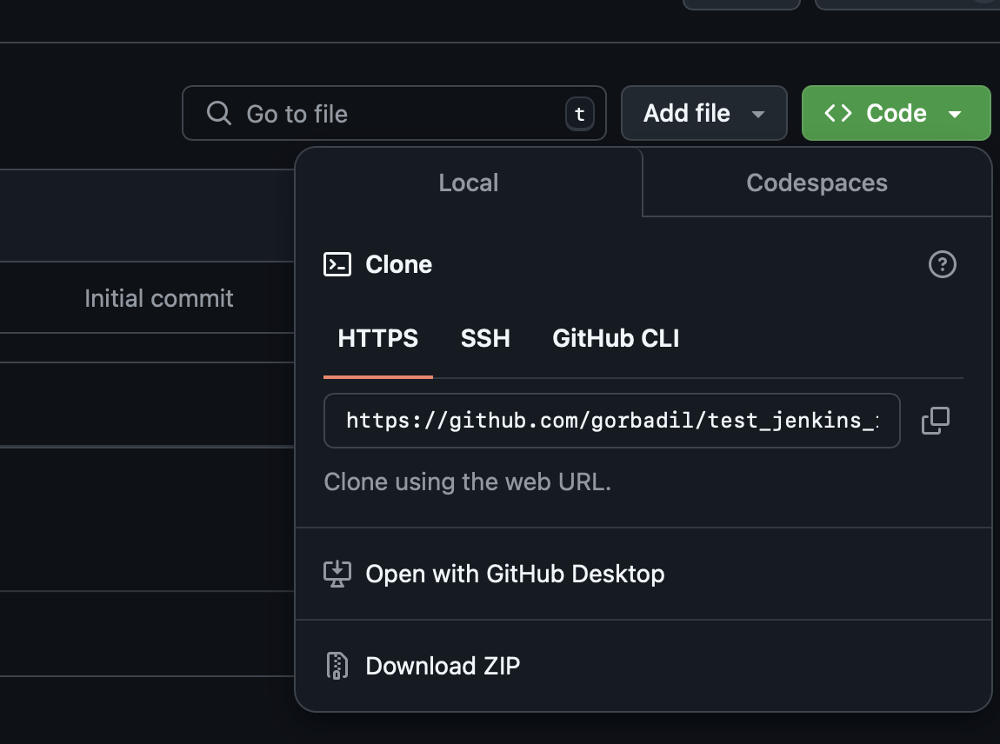
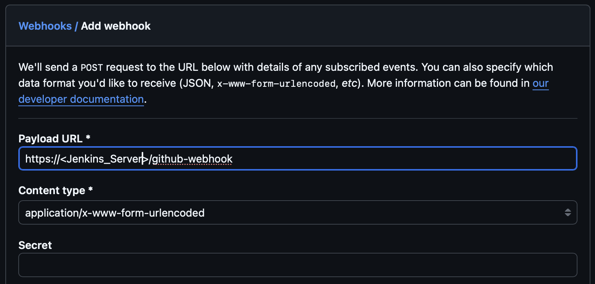

# Github Webhook with Jenkins Automation

## What is Github Webhook?

Github Webhook is a mechanism that allows Github to notify a URL by making a POST request when changes are made on Github. This way, changes made on Github can be notified to another application in real-time, and this application can perform certain actions based on this notification.

## What is Jenkins?

Jenkins is a continuous integration (CI) tool that allows software projects to be automatically compiled, tested, and deployed. Jenkins can work with many programming languages and tools, making it suitable for a wide range of use cases to automate software development processes.

## Why is it Important?

Github Webhook and Jenkins integration allows changes made in software projects to be notified to Jenkins in real-time. With this integration, changes made in software projects can be notified to Jenkins in real-time, and Jenkins can perform certain actions based on this notification. For example, changes made in a software project can be notified to Jenkins in real-time, allowing these changes to be tested and the results to be reported.

## How to Integrate Github Webhook with Jenkins?

- [VPS Üzerinde Continuous Integration/Continuous Deployment (CI/CD) Kurulumu ve Nginx Reverse Proxy](https://medium.com/@gorbadil/vps-docker-kubernetes-jenkins-installation-and-nginx-reverse-proxy-deb75d9caf80)

## Steps to Follow

1. Install and configure the Github plugin in Jenkins
2. Create a Jenkins job to build the Github project
3. Create a webhook in Github and add the Jenkins URL
4. Test the webhook

## 1. Install and Configure the Github Plugin in Jenkins

There are many plugins available in Jenkins, and these plugins can be used to extend the functionality of Jenkins. The Github plugin is used to communicate between Github and Jenkins and is required to notify Jenkins of changes made on Github.

1. On the Jenkins home page, click on **Manage Jenkins**.
2. Click on **Plugins**.
3. Click on the **Available** tab and search for the **Github plugin**.
   - If you can't find it, click on the **Installed Plugins** tab and search for the **Github plugin**. It may already be installed.
4. Select the **Github** plugin and click on **Install without restart**.
5. Go back to the Jenkins home page to confirm that the plugin has been successfully installed.

## 2. Create a Jenkins Job to Build the Github Project

We can build a Github project by creating a job in Jenkins. This job detects changes made on Github and starts the project build, reporting the results. Let's try it out by connecting to the test repo.

First, let's create a test repo on Github.

1. Log in to Github and click on **New repository**.
2. Enter a name in the **Repository name** field (e.g., **TestRepo**).
3. Check the **Initialize this repository with a README** option.
4. Click on the **Create repository** button.

Now let's create a job in Jenkins.

1. On the Jenkins home page, click on **New Item**.
2. Enter a name in the **Enter an item name** field (e.g., **TestJob**).
3. Select **Freestyle project** and click on **OK**.
4. Click on the **Source Code Management** tab and select **Git**.
   
5. Enter the URL of the Github project in the **Repository URL** field (e.g., `
6. Click on the Trigger section and check the **GitHub hook trigger for GITScm polling** option.

## 3. Create a Webhook in Github and Add the Jenkins URL

The Github Webhook is used to notify Jenkins of changes made on Github. This way, changes made on Github are notified to Jenkins in real-time, and Jenkins can perform certain actions based on this notification.

1. Go to the Github project page and click on **Settings**.
2. Click on **Webhooks** and then click on the **Add webhook** button.
3. Enter the Jenkins URL in the **Payload URL** field (e.g., `http://<jenkins-ip>:8080/github-webhook/`).
   
4. Set the **Content type** field to **application/json**.
5. Select **Just the push event** in the **Which events would you like to trigger this webhook?** section.
6. Click on the **Add webhook** button.

## 4. Test the Webhook

To test the Github Webhook, we can make a change to the Github project. This change will trigger the job we created in Jenkins, and Jenkins will run this job. For example, we can change the README file in the Github project.

1. Go to the Github project page and click on the **README** file.
2. Click on the **Edit this file** button.
3. Change the content of the README file and click on the **Commit changes** button.
4. Go to the Jenkins home page and check the results of the Jenkins job.

## Conclusion

In this article, you learned how to integrate Github Webhook with Jenkins. Github Webhook is used to notify Jenkins of changes made on Github, allowing Jenkins to perform certain actions based on this notification. With this integration, changes made in software projects can be notified to Jenkins in real-time, and Jenkins can perform certain actions based on this notification.
