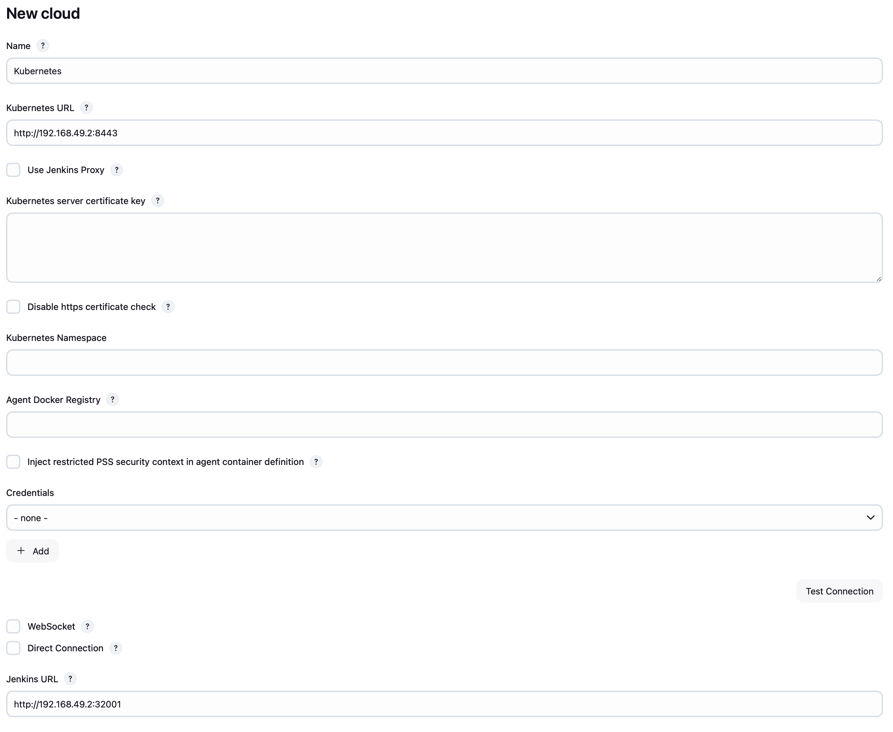

# Jenkins on Kubernetes

You could find the article about Jenkins master installation on Kubernetes from the link below..

- [Jenkins on Kubernetes](https://medium.com/@gorbadil/vps-docker-kubernetes-jenkins-installation-and-nginx-reverse-proxy-deb75d9caf80)

It is not recommended to run Jenkins agents on the Jenkins master. Maybe the workloads are not too much right now. However, when your workloads increase in the future, it is the best option to run Jenkins agents on Kubernetes.

### What are the advantages?

- Automatic scaling
  If your build or agent breaks, you no longer need to worry — Jenkins will remove the unhealthy instance and create a new one.
- Run builds in parallel
  No need to schedule and limit executors anymore; instead, Jenkins will create an agent instance and run your build inside it.
- Load distribution
  Kubernetes manages loads well and ensures that your Jenkins agents are created on the best available server, making your builds faster and more efficient.

You can follow the steps below to run Jenkins agents on Kubernetes.

## Jenkins Agent

First, we will create a Dockerfile for Jenkins agents. We will follow the documentation and run the Jenkins agent on Kubernetes. First, make sure Docker is installed.

```bash
docker --version
```

Preferred method is to start with creating Dockerfiles for Jenskins.

```Dockerfile
FROM jenkins/jenkins:lts-slim-jdk17
# Pipelines with Kubernetes
RUN jenkins-plugin-cli --plugins kubernetes
```

- FROM jenkins/jenkins:lts-slim-jdk17: It is the official image of Jenkins. It will run with LTS version and JDK 17.
  - [Official Jenkins Docker Image](https://hub.docker.com/r/jenkins/jenkins)
- RUN jenkins-plugin-cli --plugins kubernetes: It is used to install the Jenkins plugin.
  - [Jenkins Plugin Kubernetes](https://plugins.jenkins.io/kubernetes/)

After creating the Dockerfile, we will build the Docker image.

```bash
docker build -t my-jenkins-image:1.1 .
```

After creating the Docker image, check it.

```bash
docker images
```

You should see my-jenkins-image:1.1 in the list.

Then we will install Jenkins on Kubernetes.

You can install Jenkins master on Kubernetes by following the path below. The only difference is that you need to update the deployment.yaml file.

- [Jenkins on Kubernetes](https://medium.com/@gorbadil/vps-docker-kubernetes-jenkins-installation-and-nginx-reverse-proxy-deb75d9caf80)
  If you have previously installed Jenkins Master by following the same path, you only need to update the deployment.yaml file and then write the following codes.

We will update the deployment.yaml file as follows.

```yaml
apiVersion: apps/v1
kind: Deployment
metadata:
  name: jenkins
spec:
  replicas: 1
  selector:
    matchLabels:
      app: jenkins
  template:
    metadata:
      labels:
        app: jenkins
    spec:
      containers:
        - name: jenkins
          image: my-jenkins-image:1.1
          ports:
            - containerPort: 8080
          volumeMounts:
            - name: jenkins-home
              mountPath: /var/jenkins_home
      volumes:
        - name: jenkins-home
          emptyDir: {}
```

After updating the deployment.yaml file, you can run the Jenkins agent on Kubernetes.

minikube local image usage, you can run the following command.

```bash
eval $(minikube docker-env)
```

Then we can create the deployment with the following command.

```bash
kubectl apply -f deployment.yaml
```

## Jenkins Master Configuration

After running Jenkins master on Kubernetes, we need to configure Jenkins master. After running Jenkins master on Kubernetes, we need to configure Jenkins master. You can follow the steps below to configure Jenkins master.

In order to configure the Jenkins agents. We need to know the URL of the Kubernetes controller and the internal cluster URL of the Jenkins pod. You can get the Kubernetes controller URL by this specified command:

```bash
kubectl cluster-info
```

You should get an output similar to the following.

```bash
Kubernetes control plane is running at https://192.168.49.2:8443
KubeDNS is running at https://192.168.49.2:8443/api/v1/namespaces/kube-system/services/kube-dns:dns/proxy
```

After getting the Kubernetes controller URL, you can get the internal cluster URL of the Jenkins pod by the following command.

```bash
kubectl get pods -n devops-tools
```

You should get an output similar to the following.

```bash
NAME                      READY   STATUS    RESTARTS   AGE
jenkins-867cf56b4f-8c7jw   1/1     Running   0          2m
```

After getting the pod id, you can get the URL of the Jenkins pod by the following command.

```bash
kubectl describe pod jenkins-867cf56b4f-8c7jw -n devops-tools
```

You should get an output similar to the following.

```bash
…..
IP:             10.244.0.25
…..
```

Now we can configure Jenkins master. To configure Jenkins master, you can follow the steps below. Go to the Jenkins UI and click on

```
Manage Jenkins → Clouds → New cloud
```

After clicking on New cloud, you will see the following page.



```bash
kubectl cluster-info
```

```bash
Kubernetes control plane is running at https://192.168.49.2:8443
```

Jenkins URL kısmına Jenkins pod'unun URL'sini yazın.

```bash
kubectl svc -n devops-tools
```

```bash
NAME              TYPE       CLUSTER-IP       EXTERNAL-IP   PORT(S)          AGE
jenkins-service   NodePort   10.103.234.229   <none>        8080:32001/TCP   28h
```

Jenkins için url kısmına aşağıdaki şekilde yazın.

```bash
http://192.168.49.2:32001
```


After filling in the necessary information, click on the Save button.

- If you are using the HTTPS structure, you need to check the WebSocket option. Otherwise, Jenkins agents will not work.

- If you are planning to work on a specific image, you can create your own Dockerfile and run the Jenkins agent on Kubernetes. This way, you can run Jenkins agents on Kubernetes and make your Jenkins master more efficient and faster.

- After completing the installation, we will be directed to the Cloud page. From here, we will select the Kubernetes Cloud we created and click on

  - Pod templates
    .

  - Add Pod template
    we will fill in

Any name can be given, and it will be shown as a prefix for the names of automatically generated Jenkins agents. These agents will be automatically run during build processes.


Installation is complete. Now let's test it.

## Testing

We will create two build plans.

- Our first build plan will run on the Jenkins master.
- Our second build plan will run on the Jenkins agent.

You can follow the steps below to create the first build plan.

- Go to the Jenkins UI and click on

  ```
  New Item → Freestyle project
  ```

- In the General section

  ```
  Display Name: Jenkins Master
  ```

- Build Steps
  ```
  Execute shell
  ```
  select and write the following code.
  ```
  echo "Hello from Jenkins Master"
  ```
- Click on the Save button.

You can follow the steps below to create the second build plan.

- Go to the Jenkins UI and click on

  ```
  New Item → Freestyle project
  ```

- In the General section

  ```
  Display Name: Jenkins Agent
  ```

- Build Steps
  ```
  Execute shell
  ```
  select and write the following code.
  ```
  echo "Hello from Jenkins Agent"
  ```
- Restrict where this project can be run

  ```
  Label Expression: jenkins-agent
  ```

- Click on the Save button.

After creating the build plans, you can run them. You will see that the first build plan will run on the Jenkins master, and the second build plan will run on the Jenkins agent.

## Result

Running Jenkins agents on Kubernetes will make your Jenkins master more efficient and faster. By running Jenkins agents on Kubernetes, you can make your Jenkins master perform better.
