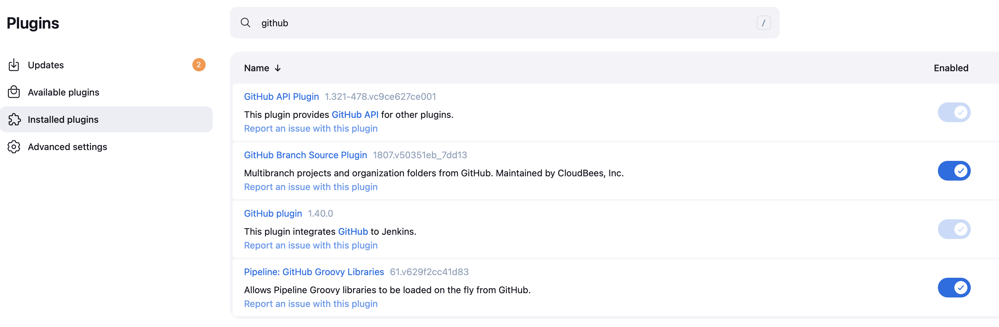
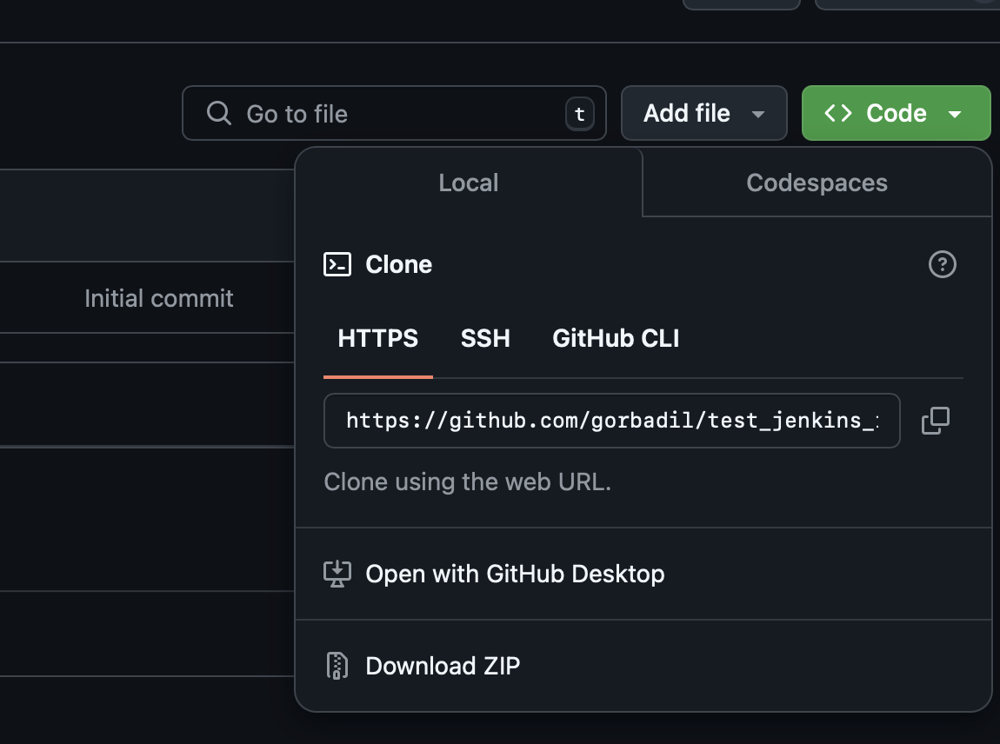
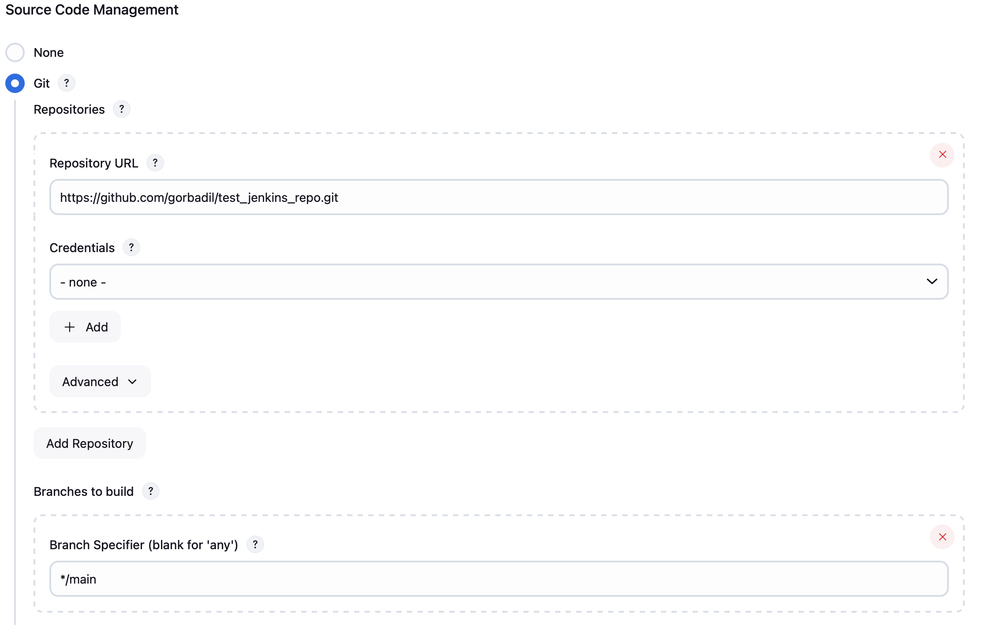
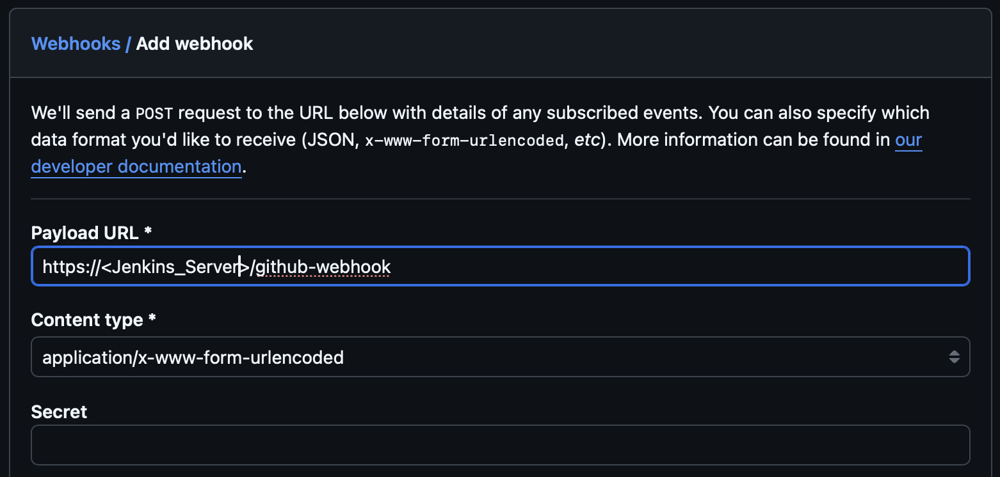

# Github Webhook ile Jenkins Otomasyonu

## Github Webhook Nedir?

Github Webhook, Github üzerinde yapılan değişikliklerin belirli bir URL'ye POST isteği yaparak bildirimde bulunmasını sağlayan bir mekanizmadır. Bu sayede Github üzerinde yapılan değişiklikler anlık olarak başka bir uygulamaya bildirilebilir ve bu uygulama bu bildirim üzerine belirli işlemler yapabilir.

## Jenkins Nedir?

Jenkins, yazılım projelerinin otomatik olarak derlenmesi, test edilmesi ve dağıtılmasını sağlayan bir sürekli entegrasyon (CI) aracıdır. Jenkins, birçok programlama dili ve araçla uyumlu çalışabilir ve bu sayede yazılım geliştirme süreçlerini otomatikleştirmek için geniş bir yelpazede kullanılabilir.

## Nede Önemli?

Github Webhook ve Jenkins entegrasyonu sayesinde yazılım projelerinde yapılan değişiklikler anlık olarak Jenkins'e bildirilebilir ve Jenkins bu bildirim üzerine belirli işlemler yapabilir. Örneğin, bir yazılım projesinde yapılan değişiklikler anlık olarak Jenkins'e bildirilerek bu değişikliklerin test edilmesi ve sonuçların bildirilmesi sağlanabilir.

**VPS Üzerinde Jenkins Kurulum**

- [VPS Üzerinde Continuous Integration/Continuous Deployment (CI/CD) Kurulumu ve Nginx Reverse Proxy](https://medium.com/@gorbadil/vps-üzerinde-continuous-integration-continuous-deployment-ci-cd-kurulumu-ve-nginx-reverse-proxy-1a4f990cc905)

## Sırasıyla Yapılacaklar

1. Jenkins'te Github eklentisini yüklemek ve yapılandırmak
2. Github projesini derlemek için bir Jenkins işi oluşturmak
3. Github'ta bir webhook oluşturmak ve Jenkins URL'sini eklemek
4. Webhook'u test etmek

## 1. Jenkins'te Github Eklentisini Yüklemek ve Yapılandırmak

Jenkins üzerinde birçok eklenti mevcuttur ve bu eklentiler Jenkins'in işlevselliğini genişletmek için kullanılabilir. Github eklentisi, Github ile Jenkins arasında iletişim kurmak için kullanılır ve Github üzerinde yapılan değişiklikleri Jenkins'e bildirmek için gereklidir.

1. Jenkins ana sayfasında, **Manage Jenkins**'e tıklayın.
2. **Plugins**'e tıklayın.
3. **Available** sekmesine tıklayın ve **Github plugin** eklentisini arayın.
   - Eğer bulamıyorsanız **Installed Plugins** sekmesine tıklayın ve **Github plugin** eklentisini arayın. Belki de zaten yüklüdür.
4. **Github** eklentisini seçin ve **Install without restart** düğmesine tıklayın.
5. Eklentinin başarıyla yüklendiğini onaylamak için Jenkins ana sayfasına dönün.

## 2. Github Projesini Derlemek İçin Bir Jenkins İşi Oluşturmak

Jenkins'te bir iş oluşturarak Github projesini derleyebiliriz. Bu iş, Github üzerinde yapılan değişiklikleri algılayarak proje derlemesini başlatır ve sonuçları bildirir. Bağlantı kurarak test repo'sunda deneyeceğiz.

Öncelikle Github üzerinde test için bir repo oluşturalım.

1. Github'a giriş yapın ve **New repository**'e tıklayın.
2. **Repository name** alanına bir isim girin (örneğin, **TestRepo**).
3. **Initialize this repository with a README** seçeneğini işaretleyin.
4. **Create repository** düğmesine tıklayın.

Şimdi Jenkins'te bir iş oluşturalım.

1. Jenkins ana sayfasında, **New Item**'a tıklayın.
2. **Enter an item name** alanına bir isim girin (örneğin, **TestJob**).
3. **Freestyle project**'i seçin ve **OK**'e tıklayın.
4. **Source Code Management** sekmesine tıklayın ve **Git**'i seçin.
   
5. **Repository URL** alanına Github projesinin URL'sini girin (örneğin, `https://github.com/<username>/TestRepo.git`)
   
6. Trigger kısmına tıklayın ve **GitHub hook trigger for GITScm polling** seçeneğini işaretleyin.

## 3. Github'ta Bir Webhook Oluşturmak ve Jenkins URL'sini Eklemek

Github Webhook, Github üzerinde yapılan değişiklikleri Jenkins'e bildirmek için kullanılır. Bu sayede Github üzerinde yapılan değişiklikler anlık olarak Jenkins'e bildirilir ve Jenkins bu bildirim üzerine belirli işlemler yapabilir.

1. Github projesinin sayfasına gidin ve **Settings**'e tıklayın.
2. **Webhooks**'a tıklayın ve **Add webhook** düğmesine tıklayın.
3. **Payload URL** alanına Jenkins URL'sini girin (örneğin, `http://<jenkins-ip>:8080/github-webhook/`).
   
4. **Content type** alanını **application/json** olarak ayarlayın.
5. **Which events would you like to trigger this webhook?** bölümünde **Just the push event**'i seçin.
6. **Add webhook** düğmesine tıklayın.

## 4. Webhook'u Test Etmek

Github Webhook'u test etmek için Github projesine bir değişiklik yapabiliriz. Bu değişiklik, Jenkins'te oluşturduğumuz işi tetikleyecek ve Jenkins bu işi çalıştıracaktır. Örneğin, Github projesindeki README dosyasını değiştirebiliriz.

1. Github projesinin sayfasına gidin ve **README** dosyasına tıklayın.
2. **Edit this file** düğmesine tıklayın.
3. README dosyasının içeriğini değiştirin ve **Commit changes** düğmesine tıklayın.
4. Jenkins ana sayfasına gidin ve Jenkins işinin sonuçlarını kontrol edin.

## Sonuç

Bu yazıda, Github Webhook ve Jenkins entegrasyonunu nasıl yapacağınızı öğrendiniz. Github Webhook, Github üzerinde yapılan değişiklikleri Jenkins'e bildirmek için kullanılır ve bu sayede Jenkins, Github üzerinde yapılan değişiklikleri algılayarak belirli işlemler yapabilir. Bu entegrasyon sayesinde yazılım projelerinde yapılan değişiklikler anlık olarak Jenkins'e bildirilebilir ve Jenkins bu bildirim üzerine belirli işlemler yapabilir.
