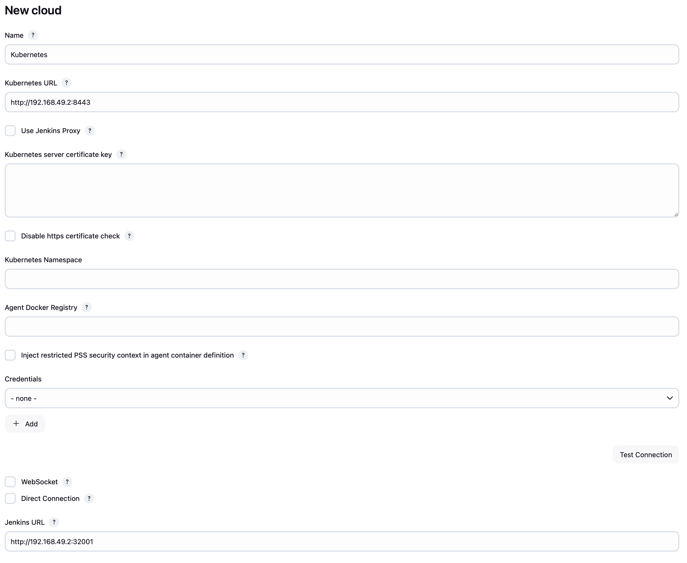
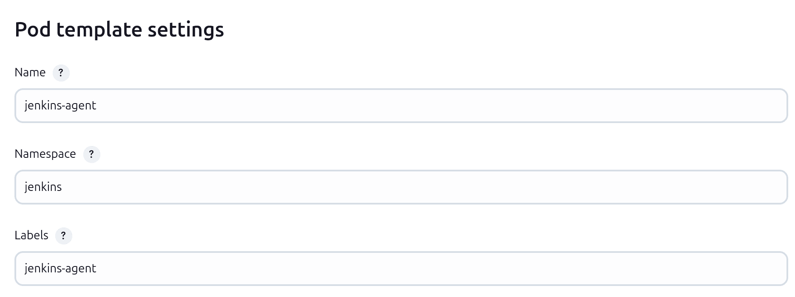

# Jenkins on Kubernetes

Jenkins master Kubernetes üzerinde kurulumu ile ilgili yazıya aşağıdaki linkten ulaşabilirsiniz.

- [Jenkins on Kubernetes](https://medium.com/@gorbadil/vps-üzerinde-continuous-integration-continuous-deployment-ci-cd-kurulumu-ve-nginx-reverse-proxy-1a4f990cc905)

Jenkins master üzerinde pipeline tercih edilen bir yöntem değildir. Belki iş yükleri şu an için çok fazla olmayabilir. Ancak gelecekte iş yükleriniz arttığında başımızın belaya girmemesi için Jenkins agent'larını Kubernetes üzerinde çalıştırmak en doğru seçenek olacaktır.

### Peki avantajları nelerdir?

- Otomatik iyileştirme mümkündür
  Eğer build'iniz veya agent'ınız bozulursa, artık endişelenmenize gerek yok — Jenkins sağlıksız örneği kaldıracak ve yeni bir tane oluşturacaktır.
- Paralel olarak build'leri çalıştırın
  Artık yürütücüleri planlamanıza ve sınırlamanıza gerek yok; bunun yerine, Jenkins bir agent örneği oluşturacak ve build'inizi onun içinde çalıştıracaktır.
- Yük dağıtımı
  Kubernetes yükleri iyi yönetir ve Jenkins agent'larınızın en iyi mevcut sunucuda oluşturulmasını sağlar, bu da build'lerinizi daha hızlı ve daha verimli hale getirir.

Jenkins agent'larını Kubernetes üzerinde çalıştırmak için aşağıdaki adımları takip edebilirsiniz.

## Jenkins Agent

Dokümantasyonunu takip ederek Jenkins agent'ını Kubernetes üzerinde çalıştıracağız. Öncelikle Docker'ın kurulu olduğundan emin olun.

```bash
docker --version
```

Önerilen yöntem olan Jenskins için Dockerfiler oluşturmak ile başlayalım.

```Dockerfile
FROM jenkins/jenkins:lts-slim-jdk17
# Pipelines with Blue Ocean UI and Kubernetes
RUN jenkins-plugin-cli --plugins kubernetes
```

- FROM jenkins/jenkins:lts-slim-jdk17: Jenkins'in official image'ıdır. LTS sürümü ve JDK 17 ile birlikte çalıştırılacaktır.
  - [Official Jenkins Docker Image](https://hub.docker.com/r/jenkins/jenkins)
- RUN jenkins-plugin-cli --plugins kubernetes: Jenkins plugin'ini yüklemek için kullanılır.
  - [Jenkins Plugin Kubernetes](https://plugins.jenkins.io/kubernetes/)

Dockerfile'ı oluşturduktan sonra Docker build işlemi yapalım.

```bash
docker build -t my-jenkins-image:1.1 .
```

Docker image oluşturduktan sonra kontrol edelim.

```bash
docker images
```

Liste içerisinde my-jenkins-image:1.1 görülmelidir.

Arından Jenkins Kubernetes kurulumu yapıyoruz.
Aşağıda linkte bulunan yolu izleyerek Jenkins master'ı Kubernetes üzerinde çalıştırabilirsiniz. Tek farklılık aşadağıki deployment.yaml dosyasını güncellemek olacaktır.

- [Jenkins on Kubernetes](https://medium.com/@gorbadil/vps-üzerinde-continuous-integration-continuous-deployment-ci-cd-kurulumu-ve-nginx-reverse-proxy-1a4f990cc905)
  Daha önce aynı yolu izleyerek Jenkins Master'ı kurduysanız, yalnızca deployment.yaml dosyasını güncellemeniz ve ardından gelen kodları yazmanız yeterli olacaktır.

deployment.yaml dosyasını aşağıdaki şekilde güncelleyeceğiz.

```yaml
apiVersion: apps/v1
kind: Deployment
metadata:
  name: jenkins
spec:
  replicas: 1
  selector:
    matchLabels:
      app: jenkins
  template:
    metadata:
      labels:
        app: jenkins
    spec:
      containers:
        - name: jenkins
          image: my-jenkins-image:1.1
          ports:
            - containerPort: 8080
          volumeMounts:
            - name: jenkins-home
              mountPath: /var/jenkins_home
      volumes:
        - name: jenkins-home
          emptyDir: {}
```

- image: my-jenkins-image:1.1: Jenkins agent'ını Kubernetes üzerinde çalıştırmak için oluşturduğumuz Docker image'ını kullanacağız.

deployment.yaml dosyasını güncelledikten sonra aşağıdaki komut ile Jenkins agent'ını Kubernetes üzerinde çalıştırabiliriz.

minikube local image kullanımı için aşağıdaki komutu çalıştırabilirsiniz.

```bash
eval $(minikube docker-env)
```

ardından aşağıdaki komut ile deployment'ı oluşturabiliriz.

```bash
kubectl apply -f deployment.yaml
```

## Jenkins Master Konfigürasyonu

Jenkins master'ı Kubernetes üzerinde çalıştırdıktan sonra Jenkins master'ı konfigüre etmemiz gerekmektedir. Jenkins master'ı konfigüre etmek için aşağıdaki adımları takip edebilirsiniz.

Jenkins agent'larını konfigüre etmek için Kubernetes controller URL'sini ve Jenkins pod'unun iç URL'sini bilmemiz gerekmektedir. Kubernetes controller URL'sini aşağıdaki komut ile alabilirsiniz.

```bash
kubectl cluster-info
```

Aşağıdaki çıktıya benzer bir çıktı almalısınız.

```bash
Kubernetes control plane is running at https://192.168.49.2:8443
KubeDNS is running at https://192.168.49.2:8443/api/v1/namespaces/kube-system/services/kube-dns:dns/proxy
```

Eğer standart konfigürasyonu kullanıyorsanız, Jenkins 8080 portunda çalışmaktadır.

Jenkins pod'unun URL'sine ulaşmak için öncelikle pod id'sini almalıyız

```bash
kubectl get pods - n devops-tools
```

Aşağıdaki çıktıya benzer bir çıktı almalısınız.

```bash
NAME                      READY   STATUS    RESTARTS   AGE
jenkins-867cf56b4f-8c7jw   1/1     Running   0          2m
```

Pod id'sini aldıktan sonra aşağıdaki komut ile Jenkins pod'unun URL'sine ulaşabilirsiniz.

```bash
kubectl describe pod jenkins-867cf56b4f-8c7jw -n devops-tools
```

Gelen çıktı içerisinde bizim için önemli olan IP adresi

```bash
…..
IP:             10.244.0.25
…..
```

Artık Jenkins Master'ı konfigüre edebiliriz. Jenkins Master'ı konfigüre etmek için, Jenkins UI'ine giriş yapın ve aşağıdaki adımları takip edin.

Jenkins UI'ine giriş yapın ve

```
Manage Jenkins → Clouds → New cloud
```

şeklinde ilerleyin.

Cloud name kısmına Kubernetes yazın ve Kubernetes'e tıklayın.

Kubernetes URL kısmına Kubernetes controller URL'sini yazın.

```bash
kubectl cluster-info
```

```bash
Kubernetes control plane is running at https://192.168.49.2:8443
```

Jenkins URL kısmına Jenkins pod'unun URL'sini yazın.

```bash
kubectl svc -n devops-tools
```

```bash
NAME              TYPE       CLUSTER-IP       EXTERNAL-IP   PORT(S)          AGE
jenkins-service   NodePort   10.103.234.229   <none>        8080:32001/TCP   28h
```

Jenkins için url kısmına aşağıdaki şekilde yazın.

```bash
http://192.168.49.2:32001
```



- Eğer HTTPS yapısı kullanıyorsanız WebSocket seçeneğini işaretlemeniz gerekiyor. Aksi takdirde Jenkins agent'ları çalışmayacaktır.

- Özel bir image üzerinde işlem yapmayı planlıyorsanız kendinize özgü Dockerfile oluşturabilir ve Jenkins agent'ını Kubernetes üzerinde çalıştırabilirsiniz. Bu sayede Jenkins agent'larını Kubernetes üzerinde çalıştırarak Jenkins master'ınızı daha verimli ve hızlı hale getirebilirsiniz.

Kayıt işlemi tamamlandıktan sonra bizi Cloud sayfasına yönlendirecek. Buradan oluşturduğumuz Kubernetes Cloud seçip sol taraftan

- Pod templates
  tıklıyoruz.

- Add Pod template
  içerisini dolduracağız.

Herhangi bir ad olabilir ve otomatik olarak oluşturulan Jenkins ajanlarının adları için bir ön ek olarak gösterilecektir. Bu ajanlar, build işlemleri sırasında otomatik olarak çalıştırılacaktır.



Kurulum tamamlandı. Şimdi testini yapalım.

İki adet build plan oluşturacağız.

- Birinci build planımız Jenkins master üzerinde çalışacak.
- İkinci build planımız Jenkins agent üzerinde çalışacak.

İlk build planı oluşturmak için aşağıdaki adımları takip edebilirsiniz.

- Jenkins UI'ine giriş yapın ve

  ```
  New Item → Freestyle project
  ```

  şeklinde ilerleyin.

- General kısmında

  ```
  Display Name: Jenkins Master
  ```

  şeklinde isim verin.

- Build Steps kısmında
  ```
  Execute shell
  ```
  seçeneğini seçin ve aşağıdaki kodları yazın.
  ```
  echo "Hello from Jenkins Master"
  ```
- Save butonuna tıklayın.

İkinci build planı oluşturmak için aşağıdaki adımları takip edebilirsiniz.

- Jenkins UI'ine giriş yapın ve

  ```
  New Item → Freestyle project
  ```

  şeklinde ilerleyin.

- General kısmında

  ```
  Display Name: Jenkins Agent
  ```

  şeklinde isim verin.

- Build Steps kısmında
  ```
  Execute shell
  ```
  seçeneğini seçin ve aşağıdaki kodları yazın.
  ```
  echo "Hello from Jenkins Agent"
  ```
- Restrict where this project can be run kısmında

  ```
  Label Expression: jenkins-agent
  ```

  şeklinde yazın.

- Save butonuna tıklayın.

Artık Jenkins agent'ını Kubernetes üzerinde çalıştırarak Jenkins master'ınızı daha verimli ve hızlı hale getirebilirsiniz.

## Sonuç

Jenkins agent'larını Kubernetes üzerinde çalıştırmak, Jenkins master'ınızı daha verimli ve hızlı hale getirecektir. Jenkins agent'larını Kubernetes üzerinde çalıştırarak, Jenkins master'ınızın daha iyi performans göstermesini sağlayabilirsiniz.
